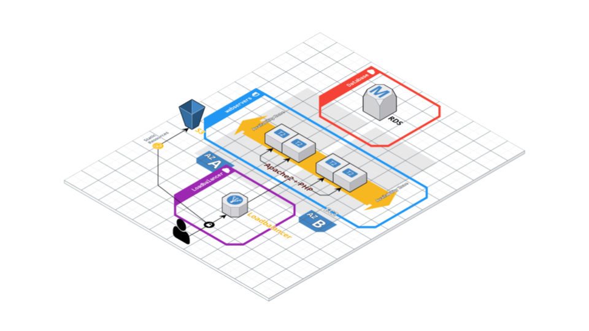

# PE 2 Groeps Opdracht 2021-2022

Automatische opbouw van een cloud web applicatie infrastructuur.

Gegeven:

* Git repository met PHP applicatie:

    [https://github.com/d-ries/2TIN_ResearchProject](https://github.com/d-ries/2TIN_ResearchProject) 

* S3 bucket of EFS met statisch assets (images)

    Zelf te maken.

* MySQL database met test data voor de PHP applicatie

    Zelf te maken.

**Maak gebruik van de mogelijkheden van AWS om de applicatie degelijk en secuur op te zetten! **

* Maak gebruik van **AZ**s om servers redundant op te zetten
* Maak **GENOEG** gebruik van **Securitygroups**, zorg ervoor dat je het Principle of Least Privilige hier goed toepast!
* Gebruik **VPC**s om interne en externe traffiek gescheiden te houden indien mogelijk

Deadline: Het eindresultaat dient via de github classroom repository te worden gepushed op 14/11/2021 om 23:59:59. 

De quotering zal gebeuren enerzijds op het functionele aspect van je opzet, anderzijds wordt er ook gekeken naar het gebruik van best practices van de gehanteerde oplossing alsook de samenwerking tussen jullie beiden en een individuele bevraging tijdens het evaluatie moment. 

# 

# Infrastructuur overzicht

De webapplicatie dient vanaf 1 vast IP te bereiken zijn maar toch fout tolerant opgezet. In de praktijk betekent dit dat we een loadbalancer gaan gebruiken die een groep van webservers (3) overziet. Zorg ervoor dat in de serverpool van de loadbalancer alle aanwezig webservers gekend zijn.

Deze webservers dienen zo geïnstalleerd dat ze een PHP webapplicatie kunnen hosten die in verbinding staat met een MySQL databank. De webapplicatie moet via git gedeployed worden zodat telkens de nieuwste versie gebruikt wordt.

Om de webservers te ontlasten zullen in de applicatie alle statische assets zoals images vanaf een S3 bucket worden gehost. Voorzie die S3 bucket en host de images daar. Pas de links in de applicatie aan zodat de images vanaf jullie bucket gehost worden.

Voorzie ook een database voor de applicatie en zorg dat deze database vanuit de applicatie gebruikt kan worden (configuratie file!)

Uitwerken van een automatische roll-out van zowel infrastructuur (servers,LB, SGs, VPCs etc) als configuratie (ssh keys, geïnstalleerde software) en software.

Gebruik Ansible en Terraform om de omgeving te automatiseren zodat er vanuit een **LEGE** AWS omgeving telkens tot dezelfde, werkend resultaat komt.

**Minimum requirements:**

* Automatisch aanmaken en configureren van VPCs, SGs, LB, RDS
* Automatisch uitrollen van EC2 instances en configureren in voorgaande diensten
* Automatisch uitrollen van de nodige configuratie en software op de EC2 instances om de web applicatie correct te laten werken
* Automatische deploy van de applicatie vanaf git
* Zorg ervoor dat het “bijschalen” van webservers geoptimaliseerd wordt door het gebruik van een custom AMI
* Wanneer er een nieuwe image op de S3 bucket gezet wordt zal deze automatisch opgenomen worden in de website.

Bovenstaande requirements zijn het minimum om te slagen op deze PE. Hoe meer er geautomatiseerd is, hoe beter je resultaat natuurlijk! 
